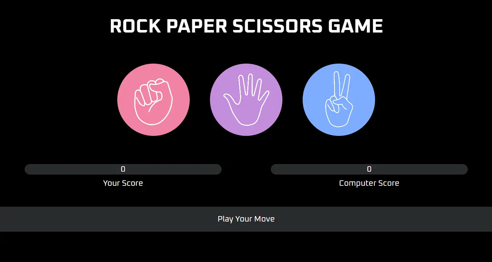

# 🎮 Rock Paper Scissors Game  

A simple **Rock Paper Scissors** game built with **HTML, CSS, and JavaScript**.  
Play against the computer and keep track of your score in real-time!  

---

## 🚀 Features  
- 🖱️ Interactive buttons for Rock, Paper, and Scissors  
- 🤖 Random computer choices  
- 🏆 Score tracking for player and computer  
- 📱 Responsive design for different screen sizes  
- ✨ Clean UI with hover effects and animations  

---

## 🖼️ Preview  
   

---

## 📂 Project Structure  
```markdown
Rock-Paper-Scissors-Game/
│
├── index.html       # Main game UI
├── style.css        # Styling and responsiveness
├── script.js        # Game logic
└── Images/          # Rock, Paper, Scissors icons, screenshot.webp
```

## ⚙️ How to Run
# Clone this repository
```markdown
git clone https://github.com/saadthedeveloper/Rock-Paper-Scissors-Game.git
```

# Open the project folder
```markdown
cd Rock-Paper-Scissors-Game
```

# Run by opening index.html in your browser

---

## 🎨 Tech Stack
- HTML5 – structure  
- CSS3 – styling & responsiveness  
- JavaScript (ES6) – game logic  

---

## ✨ Future Improvements
- 🔊 Add sound effects  
- 🎨 Add animations for win/lose/draw   

---

## 🤝 Contributing
# 1. Fork the repo
# 2. Create a new branch
```markdown
git checkout -b feature-name
```

# 3. Commit your changes
```markdown
git commit -m "Added feature-name"
```

# 4. Push to your fork
```markdown
git push origin feature-name
```

# 5. Create a Pull Request

---

## 📜 License
This project is licensed under the MIT License – feel free to use and modify it.  

---

## 👨‍💻 Author
saadthedeveloper – [GitHub](https://github.com/saadthedeveloper)  
